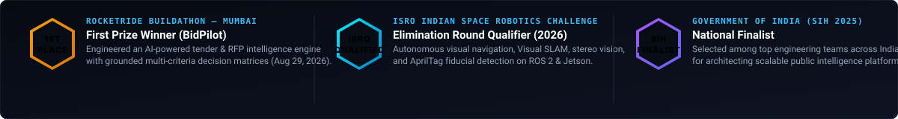
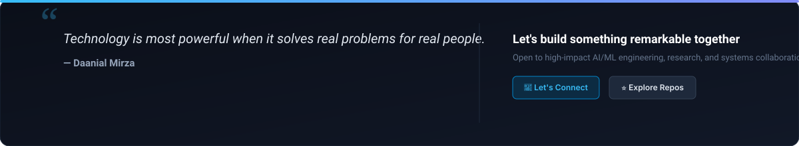

<div align="center">

<!-- Cyber Hero Banner with Integrated Terminal Simulation -->
<a href="https://github.com/daanialmirza5">
  
</a>

<br/>

<!-- High-Tech Telemetry HUD Ribbon -->
<a href="https://github.com/daanialmirza5?tab=repositories">
  
</a>

</div>

---

### Executive Profile & Systems Thesis

```text
Identity:       Daanial Mirza (@daanialmirza5)
Current Role:   Software Engineering Intern @ Orion Innovation (India)
Education:      Final Year AI/ML Scholar @ SIES Graduate School of Technology (SIES GST)
Core Focus:     Deterministic AI • Graph Reasoning • Autonomous Robotics • Distributed Platforms
Specialization: Mathematical Constraint Engines • Physics-Informed Twins • Real-Time Edge Perception
Location:       Mumbai, India
```

I architect and engineer software systems spanning **graph-based decision engines**, **physics-informed digital twins**, **offline-first healthcare platforms**, and **multi-agent research pipelines**. Currently engineering software at **Orion Innovation**, with extensive hands-on track record across **robotics / autonomous systems** and **full-stack engineering**.

---

### Professional Experience & Engineering Track Record

| Role / Experience | Organization / Focus | Engineering Scope & Technical Achievements |
| :--- | :--- | :--- |
| **Software Engineering Intern** | **Orion Innovation (India)** | Engineering scalable distributed architectures, enterprise graph intelligence workflows, and resilient full-stack systems. |
| **Robotics & Autonomous Systems Intern** | **Autonomous Systems Research** | Engineered autonomous navigation, Visual SLAM, stereo perception, and AprilTag fiducial tracking on ROS 2, MAVLink, and NVIDIA Jetson for competitive space robotics (ISRO ISRC 2026). |
| **Full-Stack Web Development Intern** | **Production Web Platforms** | Architected high-concurrency web applications, microservices with FastAPI/Node.js, PostgreSQL/PostGIS spatial databases, and reactive Next.js 15 frontends. |
| **AI/ML Engineering Scholar** | **SIES Graduate School of Technology** | Final year engineering specialization in Artificial Intelligence, Machine Learning, and Distributed Computing. |

---

### Competitive Engineering & Verified Honors

<div align="center">
  
</div>

---

### Technical Capabilities Matrix

| Domain | Core Tooling & Frameworks |
| :--- | :--- |
| **Languages** | `Python 3.12` · `C++` · `C` · `TypeScript` · `JavaScript` · `Kotlin` · `SQL` |
| **AI, Vision & Reasoning** | `PyTorch` · `TensorFlow` · `OpenCV` · `YOLO` · `LangGraph` · `scikit-learn` · `Qdrant` · `ChromaDB` |
| **Autonomous Systems & Robotics** | `ROS 2` · `MAVLink` · `Visual SLAM` · `NVIDIA Jetson` · `Pixhawk` · `Linux Embedded` |
| **Backend & Architecture** | `FastAPI` · `Next.js (App Router)` · `Express` · `Node.js` · `Celery` · `WebSockets` |
| **Databases & Concurrency** | `PostgreSQL` · `PostGIS` · `Prisma ORM` · `Drizzle ORM` · `SQLite` · `Redis` · `Firebase` |
| **Frontend & Mobile Platforms** | `React 18` · `Next.js 15` · `Tailwind CSS` · `Jetpack Compose` · `Expo / React Native` |
| **DevOps & Verification** | `Docker` · `Git` · `GitHub Actions CI/CD` · `Vitest` · `pytest` · `Linux Tooling` |

<br/>

<div align="center">
  
</div>

---

### Flagship Systems Architecture

```text
Curated production-grade codebases demonstrating deterministic algorithms, graph theory, and edge deployment.
```

<table>
  <tr>
    <td width="50%" valign="top">
      <h4><a href="https://github.com/daanialmirza5/InspectEdge">InspectEdge</a> <code>[Public]</code></h4>
      <p><b>Edge AI Industrial Defect Detection & Quality Control System</b></p>
      <p>Real-time edge YOLO inference pipeline with transparent decision policies, calibrated defect confidence scoring, and low-latency industrial analytics.</p>
      <p><code>Python 3.12</code> · <code>YOLO</code> · <code>FastAPI</code> · <code>OpenCV</code></p>
      <p>Stars: <b>1</b> &nbsp;|&nbsp; Forks: <b>0</b> &nbsp;|&nbsp; <a href="https://github.com/daanialmirza5/InspectEdge"><b>[Repository]</b></a></p>
    </td>
    <td width="50%" valign="top">
      <h4><a href="https://github.com/daanialmirza5/EcoSynapse-AI">EcoSynapse AI</a> <code>[Public]</code></h4>
      <p><b>Evidence-Grounded Ecological Decision-Support Platform</b></p>
      <p>Domain-specific environmental intelligence synthesizing scientific literature, knowledge graphs, and verifiable RAG pipelines for biodiversity and land management.</p>
      <p><code>Python</code> · <code>Knowledge Graph</code> · <code>FastAPI</code> · <code>RAG</code></p>
      <p>Stars: <b>1</b> &nbsp;|&nbsp; Forks: <b>0</b> &nbsp;|&nbsp; <a href="https://github.com/daanialmirza5/EcoSynapse-AI"><b>[Repository]</b></a></p>
    </td>
  </tr>

  <tr>
    <td width="50%" valign="top">
      <h4><a href="https://github.com/daanialmirza5/EcoLens">EcoLens</a> <code>[Public]</code></h4>
      <p><b>Geospatial Environmental Intelligence & Monitoring Platform</b></p>
      <p>High-resolution geospatial analytics platform powered by PostGIS spatial queries, reactive time-series environmental mapping, and real-time sensor ingestion.</p>
      <p><code>TypeScript</code> · <code>PostGIS</code> · <code>Mapbox</code> · <code>FastAPI</code></p>
      <p>Stars: <b>1</b> &nbsp;|&nbsp; Forks: <b>0</b> &nbsp;|&nbsp; <a href="https://github.com/daanialmirza5/EcoLens"><b>[Repository]</b></a></p>
    </td>
    <td width="50%" valign="top">
      <h4><a href="https://github.com/daanialmirza5/SkillGraph">SkillGraph</a> <code>[Public]</code></h4>
      <p><b>Evidence-Based Capability Scoring & Graph Engine</b></p>
      <p>Replaces keyword matching with mathematical graph theory: DAG dependency traversal, half-life decay modeling, and what-if simulation workflows.</p>
      <p><code>Python</code> · <code>FastAPI</code> · <code>Graph Theory</code> · <code>React</code></p>
      <p>Stars: <b>1</b> &nbsp;|&nbsp; Forks: <b>0</b> &nbsp;|&nbsp; <a href="https://github.com/daanialmirza5/SkillGraph"><b>[Repository]</b></a></p>
    </td>
  </tr>

  <tr>
    <td width="50%" valign="top">
      <h4><a href="https://github.com/daanialmirza5/gridmind">GridMind</a> <code>[Public]</code></h4>
      <p><b>Physics-Informed Building Digital Twin & Optimization Engine</b></p>
      <p>Linear programming dispatch optimization for battery storage under dynamic tariffs, telemetry anomaly detection, and building energy modeling.</p>
      <p><code>Python</code> · <code>FastAPI</code> · <code>Digital Twin</code> · <code>Next.js</code></p>
      <p>Stars: <b>1</b> &nbsp;|&nbsp; Forks: <b>0</b> &nbsp;|&nbsp; <a href="https://github.com/daanialmirza5/gridmind"><b>[Repository]</b></a></p>
    </td>
    <td width="50%" valign="top">
      <h4><a href="https://github.com/daanialmirza5/triprescue">TripRescue</a> <code>[Public]</code></h4>
      <p><b>Explainable Multi-Leg Disruption Recovery Engine</b></p>
      <p>Models complex multi-segment itineraries as a DAG, evaluates cascade delay propagation, and solves Pareto-optimal multi-objective rerouting.</p>
      <p><code>Python</code> · <code>FastAPI</code> · <code>React 18</code> · <code>TypeScript</code></p>
      <p>Stars: <b>1</b> &nbsp;|&nbsp; Forks: <b>0</b> &nbsp;|&nbsp; <a href="https://github.com/daanialmirza5/triprescue"><b>[Repository]</b></a></p>
    </td>
  </tr>

  <tr>
    <td width="50%" valign="top">
      <h4><a href="https://github.com/daanialmirza5/deep-research-ai">Deep Research AI</a> <code>[Public]</code></h4>
      <p><b>Multi-Agent Cyclic Research Engine with Citation Grounding</b></p>
      <p>10-agent cyclical LangGraph pipeline orchestrating autonomous planning, web retrieval, cross-source fact-checking, and grounded report synthesis.</p>
      <p><code>Python</code> · <code>LangGraph</code> · <code>ChromaDB</code> · <code>FastAPI</code></p>
      <p>Stars: <b>1</b> &nbsp;|&nbsp; Forks: <b>0</b> &nbsp;|&nbsp; <a href="https://github.com/daanialmirza5/deep-research-ai"><b>[Repository]</b></a></p>
    </td>
    <td width="50%" valign="top">
      <h4><a href="https://github.com/daanialmirza5/Rag-forge-ai">RAG Forge AI</a> <code>[Public]</code></h4>
      <p><b>Multi-Tenant RAG SaaS Platform with Hybrid Search</b></p>
      <p>Hybrid semantic dense + sparse BM25 retrieval with Reciprocal Rank Fusion (RRF), cross-encoder neural reranking, and LangGraph orchestration.</p>
      <p><code>Python</code> · <code>Qdrant</code> · <code>FastAPI</code> · <code>Next.js</code></p>
      <p>Stars: <b>1</b> &nbsp;|&nbsp; Forks: <b>0</b> &nbsp;|&nbsp; <a href="https://github.com/daanialmirza5/Rag-forge-ai"><b>[Repository]</b></a></p>
    </td>
  </tr>
</table>

<p align="right">
  <a href="https://github.com/daanialmirza5?tab=repositories"><b>Index of all 22 active repositories ➔</b></a>
</p>

---

### Systems & Architecture Directory

<details open>
<summary><b>Artificial Intelligence, Multi-Agent Systems & Information Retrieval</b></summary>
<br/>

- **[Deep Research AI](https://github.com/daanialmirza5/deep-research-ai)** — 10-agent cyclical LangGraph pipeline with autonomous citation & fact-checking.
- **[RAG Forge AI](https://github.com/daanialmirza5/Rag-forge-ai)** — Enterprise multi-tenant RAG platform with hybrid dense/sparse search & cross-encoder reranking.
- **[AI Meeting Follow-Up Agent](https://github.com/daanialmirza5/ai-meeting-followup-agent)** — Meeting intelligence agent extracting structured decisions & generating RFC 5545 iCal follow-ups (Groq / LLaMA-3).
- **[RakshaCall](https://github.com/daanialmirza5/RakshaCall)** — Privacy-first, client-only real-time scam call protection assistant detecting social engineering in-flight.
- **[AuraAI](https://github.com/daanialmirza5/AuraAI)** — Autonomous on-device multi-agent assistant for Android across 18 modular Gradle subprojects.

</details>

<details>
<summary><b>Computer Vision, Robotics & Edge Systems</b></summary>
<br/>

- **[InspectEdge](https://github.com/daanialmirza5/InspectEdge)** — Industrial defect detection and quality control with calibrated YOLO inference policies.
- **[AgriSentinel](https://github.com/daanialmirza5/AgriSentinel)** — Intelligent crop inspection and precision-agriculture rover simulation.
- **[ISRO Space Robotics Stack](https://github.com/daanialmirza5)** — Visual SLAM, ROS 2, MAVLink, AprilTag fiducial tracking, and Jetson/Pixhawk autonomous flight.
- **[IQOO-MAA-AI (MaAI)](https://github.com/daanialmirza5/IQOO-MAA-AI)** — Offline-first React Native app for frontline healthcare workers with on-device camera anemia screening (OCR/CV).

</details>

<details>
<summary><b>Environmental, Geospatial & Physics-Informed Intelligence</b></summary>
<br/>

- **[EcoSynapse AI](https://github.com/daanialmirza5/EcoSynapse-AI)** — Evidence-grounded ecological decision support and biodiversity knowledge graph.
- **[EcoLens](https://github.com/daanialmirza5/EcoLens)** — Geospatial environmental intelligence platform with PostGIS spatial pipelines and Mapbox reactive layers.
- **[CoolGrid (Webverse)](https://github.com/daanialmirza5/Coolgrid-Webverse)** — Physics-informed urban heat island digital twin modeling canopy mitigation ROI (PINN, XGBoost, Docker).
- **[GridMind](https://github.com/daanialmirza5/gridmind)** — Microgrid building digital twin with linear programming energy dispatch under dynamic tariffs.

</details>

<details>
<summary><b>Resilient Full-Stack & Concurrency Systems</b></summary>
<br/>

- **[SkillGraph](https://github.com/daanialmirza5/SkillGraph)** — Graph-native capability scoring platform with DAG dependency traversal and knowledge half-life modeling.
- **[Lifeline OS](https://github.com/daanialmirza5/lifeline-os)** — Offline-first clinical continuity layer with CRDT conflict resolution and encounter graphs.
- **[TrustLedger](https://github.com/daanialmirza5/trustledger)** — Double-entry financial decision-support intelligence platform for small businesses with runway simulations.
- **[TripRescue](https://github.com/daanialmirza5/triprescue)** — DAG-based multi-leg travel disruption recovery engine with Pareto-optimal rerouting.
- **[CivicFlow](https://github.com/daanialmirza5/civicflow)** — GovTech public service navigation platform with deterministic eligibility rule graphs.
- **[Turfmate](https://github.com/daanialmirza5/Turfmate)** — Sports turf venue booking with transactional row-level slot locking & QR receipts.
- **[Cricket Auction](https://github.com/daanialmirza5/cricket-auction)** — Real-time WebSocket player auction room with live budget constraints ([Live Demo](https://cricket-auction-cyan.vercel.app)).

</details>

---

### Engineering Standards & Invariants

<div align="center">
  
  &nbsp;&nbsp;
  
</div>

<br/>

- **Deterministic Grounding**: AI reasoning systems are strictly constrained by domain validation logic, physics invariants, and verified context.
- **Zero Fabrication**: Every performance claim, architecture diagram, and metric is backed by executable code in public repositories.
- **Automated Verification**: End-to-end and unit test suites integrated across CI/CD workflows.

---

### Contact & Engineering Collaboration

<div align="center">
  <a href="https://www.linkedin.com/in/daanialmirza5/">
    
  </a>
  &nbsp;&nbsp;
  <a href="https://github.com/daanialmirza5">
    
  </a>
  &nbsp;&nbsp;
  <a href="mailto:daanialmirza5@gmail.com">
    
  </a>
</div>

<br/>

<div align="center">
  <a href="https://github.com/daanialmirza5">
    
  </a>
</div>

<br/>

<div align="center">
  <sub>Engineered by <b>Daanial Mirza</b> • <a href="https://github.com/daanialmirza5">github.com/daanialmirza5</a></sub>
</div>
